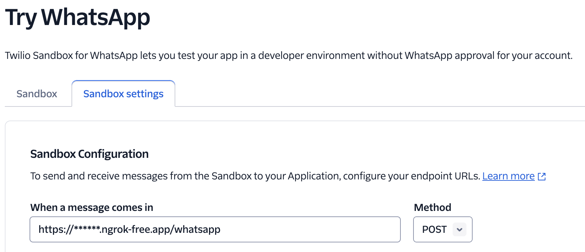

# Twilio Challenge

Ref: https://dev.to/suyashsrivastavadev/very-own-bookmarks-f4c

Execute : `fastapi dev main.py`

Setup the keys for Twilio & Gemin API as per the [demo.env](env/demo.env) file.

Twilio service :


For exposing local services used [ngrok](https://ngrok.com/)

- Fetch the forwarding url `ngrok http http://localhost:8000`
- Set the sandbox url as per the ngrok 



## Example

```json
{
  "output": "Here are 5 excellent sites to learn PyTorch:\n\n1. **PyTorch Official Website:** [https://pytorch.org/](https://pytorch.org/)\n   * **Best for:** Comprehensive documentation, tutorials, and examples. Offers a great starting point and covers a wide range of topics.\n\n2. **PyTorch Tutorials:** [https://pytorch.org/tutorials/](https://pytorch.org/tutorials/)\n   * **Best for:** Hands-on learning through structured tutorials covering essential concepts like tensors, autograd, neural networks, and more.\n\n3. **Deeplizard:** [https://www.deeplizard.com/learn/video/0LhiS6yu4wo](https://www.deeplizard.com/learn/video/0LhiS6yu4wo)\n   * **Best for:**  Video-based learning with clear explanations and engaging visual aids. Excellent for beginners to grasp core concepts.\n\n4. **fast.ai:** [https://course.fast.ai/](https://course.fast.ai/)\n   * **Best for:** Practical, project-driven learning focusing on building real-world applications using PyTorch. Covers both beginner and advanced topics.\n\n5. **Paperspace Gradient:** [https://www.paperspace.com/blog/pytorch-tutorial-for-beginners](https://www.paperspace.com/blog/pytorch-tutorial-for-beginners)\n   * **Best for:** Step-by-step guides with clear code examples and explanations, targeting both beginners and those with some experience in deep learning.\n\nThese websites provide diverse learning paths and cater to various learning styles. Choose the resources that best suit your needs and dive into the exciting world of PyTorch! \n"
}
```


